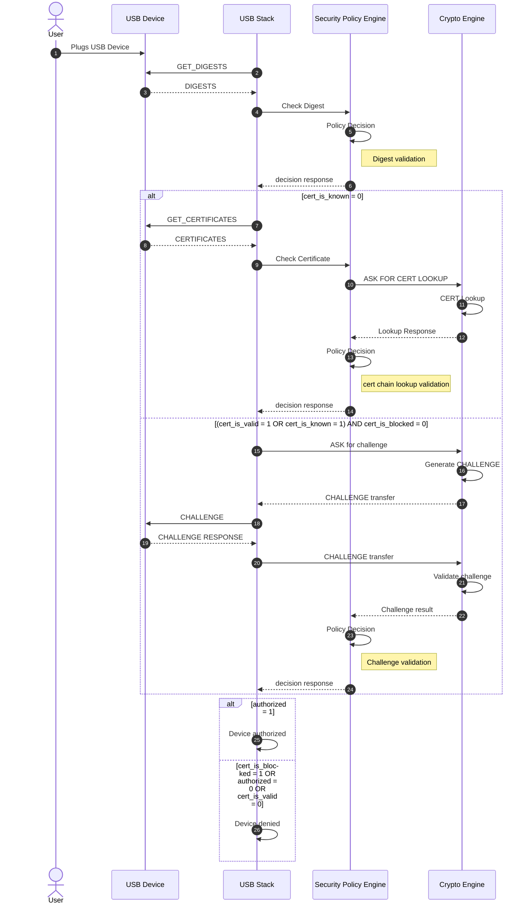
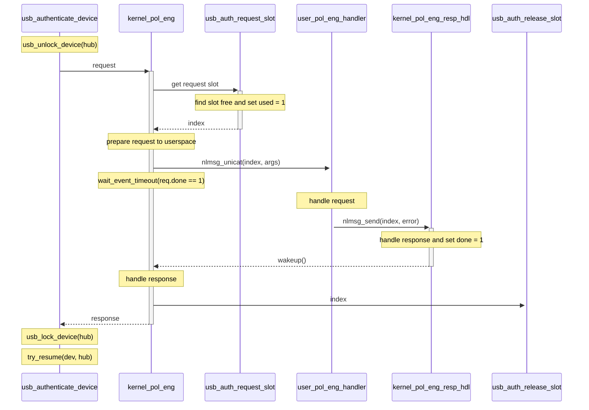

# Linux USB Authentication architecture

## Entities

The following entities are used in the architecture:

- Device : USB peripheral acting as Device, it is also called "Authentication
Responder" in the USB specification
- Host : USB Host, it is also called "Authentication Initiator" in the USB
specification. It is typically the role used by Linux USB stack.
- Manufacturer : constructor of USB devices
- Administrator : system administrator in charge of enforcing a security policy
on USB device usage in a system of USB hosts
- User : unprivileged user of the system

The Host can have the following administration interfaces:

- Configuration of device constructors' certificates
- Configuration of certificate revocation list (or OCSP service)
- Configuration of security policy (which device is authorized on the host)
- Security logs

## Design choices

The host logical architecture is divided in 4 subsystems :

- A `USB stack`, this subsystem implements the USB protocol and the
authentication functions. It can either be a kernel implementation or a
userspace standalone USB driver.
- A `Cryptographic Engine`,  this subsystem manage the host keys (creation,
storage, usage). It can either be a kernel implementation or an independent
software or hardware component. It is out of the scope of this project and can
be vendor/hardware dependant.
- A `Security policy Engine`. This subsystem manage the host security policy.
- A `Storage backend`. It is out of the cope of this project and can be
vendor/hardware dependant.

In this project, we chose to use the kernel `USB stack` in order to implement
the authentication function as soon as a new peripheral is connected to the
system.

The `Security policy Engine` and the `Cryptographic Engine` are implemented as a
userspace service. This is done in order to limit impact on the kernel side and
allows for more personalization later-on.

In the current implementation, provided in this project, the `Security policy
Engine` and the `Cryptographic Engine` have been implemented in the same
userspace software but the they could implemented separately.

## Security model

The USB Authentication targets the risk of compromission from rogue USB devices.

As such, all USB devices (external or internal) are initially considered
untrusted. Once a USB device has been authenticated by the protocol it is
considered trusted.

It is assume that the constructor or system administration provision a unique
authentication key in each device.

In the case where an attacker has managed to either extract the private
authentication key of a legitimate device or tamper with a legitimate device
firmware. It is the responsibility of the system administrator to revoke the
device key and update the Certificate Revocation List accordingly.

The Linux kernel is considered trusted and ensures the integrity of the USB
stack implementation.

By default, unprivileged user software is unstrusted. Even though depending on
the security policy the user could be trusted to manually approve devices.

Only privileged software with the `CAP_SYS_ADMIN` capability is trusted to
modify the security policy and enforce it.

The current implementation comes with the limitations of the authentication
protocol specified by the USB-IF. Devices are only authenticated once after the
connection and there is no protection against device swap or MitM.

## Protocol overview

The overall sequence diagram of a device connection is described below.

In order to reduce the attack surface and in-kernel complexity, policy
management, crypto operations and complex parsing have been implemented
in userspace using the generic netlink API. The full authentication
protocol is kernel driven.

The following unicast netlink commands have been defined in order to
fulfill device authentication :

- USBAUTH_CMD_REGISTER

This is the beginning of any authentication. The kernel first wait for
the userspace service to connect to the socket using the
`USBAUTH_CMD_REGISTER` netlink command.
Upon connection, the kernel check that the userspace service has the
`CAP_SYS_ADMIN` capability before enrolling the service. Only one
userspace service can be registered.

- USBAUTH_CMD_CHECK_DIGEST

The kernel then sends a `USBAUTH_CMD_CHECK_DIGEST` netlink command to
the policy engine to be verified. The policy engine checks if the device
certificates has already been encountered.

- USBAUTH_CMD_RESP_DIGEST

After the policy engine has received a USB device certificate digest
list from kernel, it needs to reply if it knows one of them using the
`USBAUTH_CMD_RESP_DIGEST` netlink command.

- USBAUTH_CMD_CHECK_CERTIFICATE

The kernel then sends a `USBAUTH_CMD_CHECK_CERTIFICATE` netlink command
to the policy engine. Each command contains one certificate chain. The
policy engine verifies if the device certificate chain is trusted.

- USBAUTH_CMD_RESP_CERTIFICATE

After checking the certificate chain, the policy engine sends a
`USBAUTH_CMD_RESP_CERTIFICATE` response. It tells the kernel if the
device certificate chain is trusted and thus if the device
authentication should continue.

Once device has been validated either through the digest or certificate
chain validation, an authentication session is started and a device ID
is associated for this session. The ID will then be used in all the
following commands.

- USBAUTH_CMD_GEN_NONCE

Kernel then asks for a nonce generation in order to challenge the device
using the `USBAUTH_GEN_NONCE` netlink command.

- USBAUTH_CMD_RESP_GEN_NONCE

When the nonce has been generated by the policy engine it is sent back
to the kernel using the `USBAUTH_CMD_RESP_GEN_NONCE` netlink command.

- USBAUTH_CMD_CHECK_CHALL

Once the kernel has received a device challenge response, it forwards
the response to the policy engine for validation using the
`USBAUTH_CMD_CHECK_CHALL` netlink command.

- USBAUTH_CMD_RESP_CHECK_CHALL

The policy engine then verifies the challenge and replies its decision
to the kernel using the `USBAUTH_CMD_RESP_CHECK_CHALL` netlink command.

- USBAUTH_CMD_REMOVE_DEV
- USBAUTH_CMD_RESP_REMOVE_DEV

Those two commands have been provisioned but have not been implemented yet.
If at any time, the policy engine wants to remove the trust in a device,
then the `USBAUTH_CMD_REMOVE_DEV` would to be sent, the kernel replies
with an error status through the `USBAUTH_CMD_RESP_REMOVE_DEV` command.

## Protocol for message passing between kernel and userspace

Requests are exchanged between kernel and userspace using a generic netlink
socket.

The kernel first wait for the userspace service to connect to the socket. Upon
connection, the kernel check that the userspace service has the `CAP_SYS_ADMIN`
capability before enrolling the service.

Once a userspace service is connected, the kernel send requests with the
following sequence:

- It releases the lock on the usb hub in order not to stall the USB stack
- It register a request structure with a handle in dedicated waiting queue and
sends the request on the socket to the userspace
- Responses from userspace are received by a generic handler that stores the
response in the request structure and wakes up the usb worker
- Before resuming its operations, the usb worker must reacquire the usb hub lock

## Current limitations and reflections

The kernel is dependant on the user space program availability. It will
probably be necessary to introduce fail-safe mechanism if the authentication can
not be completed. Also, during early boot stages the user space service will be
needed in one form or another in the `initramfs`.
